# Case Study: WQD7005 Report

## Introduction

This report presents the findings from the WQD7005 case study, about retail and customer behavior analysis. The data is generated using LLM using Gemini-2.5-Flash-Preview-0417. Then, we perform feature engineering and data preprocessing. We perform sentiment analysis using LLM and then build a classification model to predict customer churn.

We also perform RFM (Recency, Frequency, Monetary) analysis to segment customers based on their purchasing behavior. The report includes visualizations and insights derived from the data, along with the performance of various machine learning models.

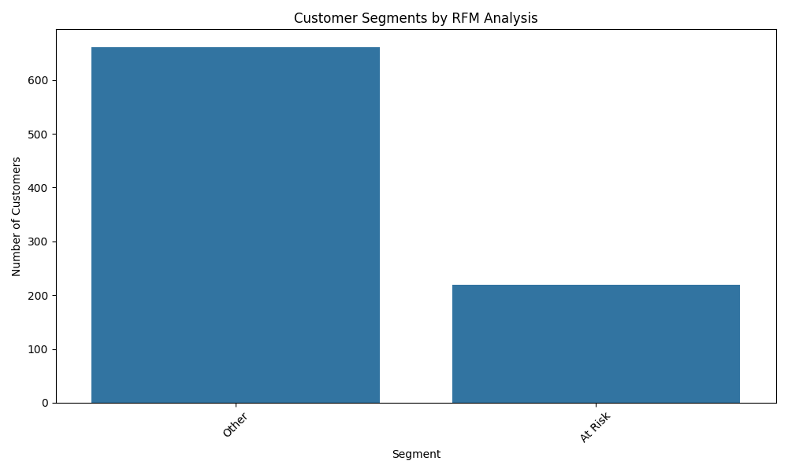

We can see that the RFM analysis has segmented customers into different groups based on their purchasing behavior. The segments are defined as follows: others and at risk.

## Decision Tree

Here is the output of the decision tree model, which is trained to predict customer churn based on various features. The decision tree provides a clear visualization of how decisions are made based on the input features. We can see the tree is not too deep and wide which provides a good balance between complexity and interpretability.

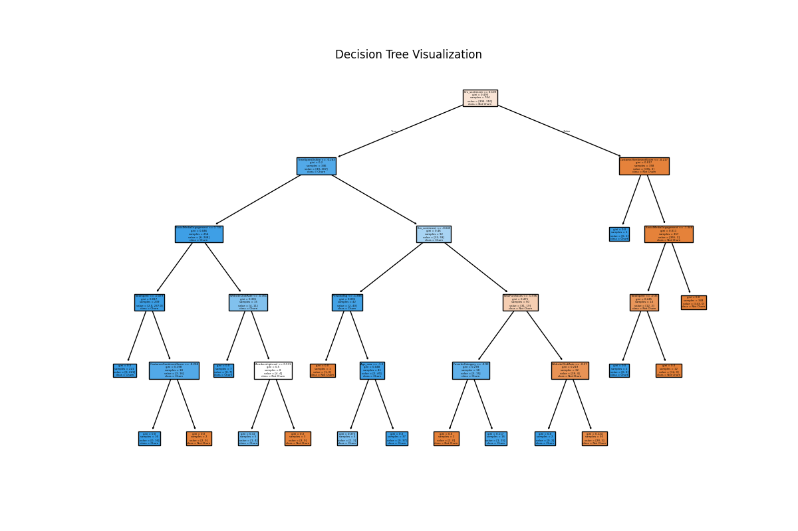

The confusion matrix shows the performance of the decision tree model on the test set. The model has a high accuracy, with most predictions being correct. The evaluation metrics indicate that the model performs well in terms of precision, recall, and F1-score.

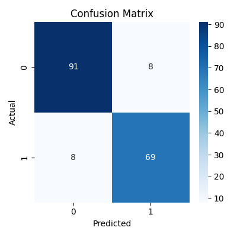

The classification report provides detailed metrics for each class, including precision, recall, and F1-score. The model performs well across all classes, indicating that it is effective in predicting customer churn.

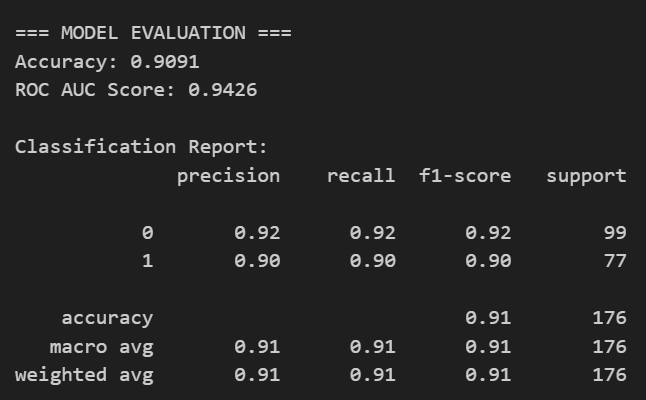

The feature importance plot shows the relative importance of each feature in the decision tree model. Features such as 'llm_sentiment' are among the most important, indicating that these factors play a significant role in predicting customer churn.

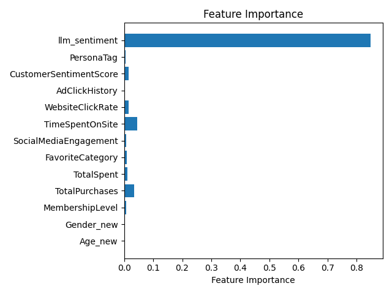

## Customer Segmentation

We also performed k-means clustering to segment customers into different groups based on their features. The elbow method was used to determine the optimal number of clusters, which was found to be 5 which is an LLM derived insights. The silhouette score also supports this choice, indicating that the clusters are well-separated and distinct.

**LLM Insights:**

Based on the provided plots, the Elbow Method suggests that a reasonable number of clusters could be around k=4 or k=5, as the rate of decrease in inertia begins to slow down significantly around these points, forming an "elbow". The Silhouette Method, which measures how similar an object is to its own cluster compared to other clusters, indicates that the highest silhouette score is achieved at k=6. While there isn't perfect agreement between the two methods, the silhouette score provides a more quantitative measure of cluster quality, suggesting that k=6 results in the best-defined clusters in terms of separation and compactness. Therefore, considering both analyses, k=6 is the most strongly supported number of clusters based on these metrics.

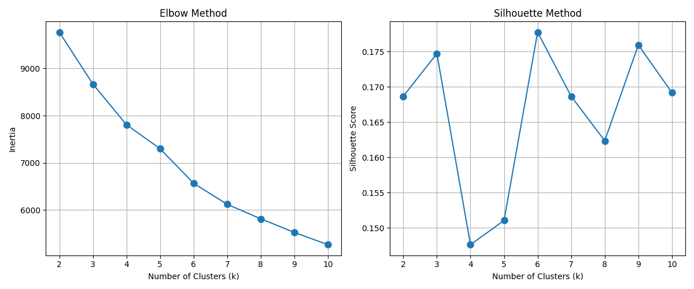

Based on the provided image, which is a PCA visualization of a clustering result using 5 clusters, it is shown how data points and their assigned centroids are distributed in a 2D space. However, this plot alone does not provide the necessary information from standard metrics like the Elbow Method or the Silhouette Method to definitively determine the *optimal* number of clusters for the dataset. The Elbow Method typically looks for a point where the rate of decrease in inertia sharply changes, while the Silhouette Method assesses how well each point fits its cluster compared to others; the results of these methods are usually presented as separate plots or scores for varying numbers of clusters, which are not included here. Therefore, without access to the actual results from the Elbow Method and Silhouette Method, it is not possible to conclude what the best number of clusters is based on those criteria, although the plot visualizes the spatial separation achieved with a 5-cluster solution.

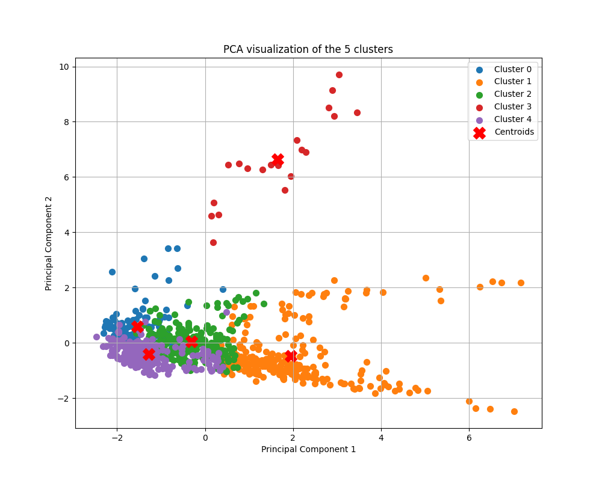

## Churn Prediction With Ensemble Model

Here is the output of the ensemble model, which is trained to predict customer churn based on various features. We trained 3 models namely random forest, adaboost, and xgboost. The ensemble model combines the predictions of these models to improve accuracy and robustness.

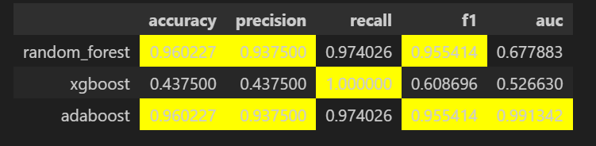

The confusion matrices for the ensemble model show the performance of each individual model on the test set. The models have high accuracy, with most predictions being correct. The evaluation metrics indicate that the models perform well in terms of precision, recall, and F1-score.

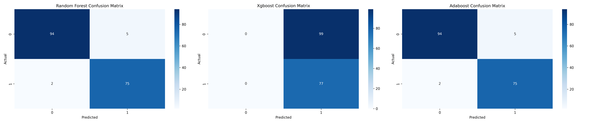

The ROC curves for the ensemble model show the trade-off between true positive rate and false positive rate for each model. The area under the curve (AUC) indicates the overall performance of the models, with higher values indicating better performance. We notice the adaboost model has the highest AUC, followed by random forest and xgboost.

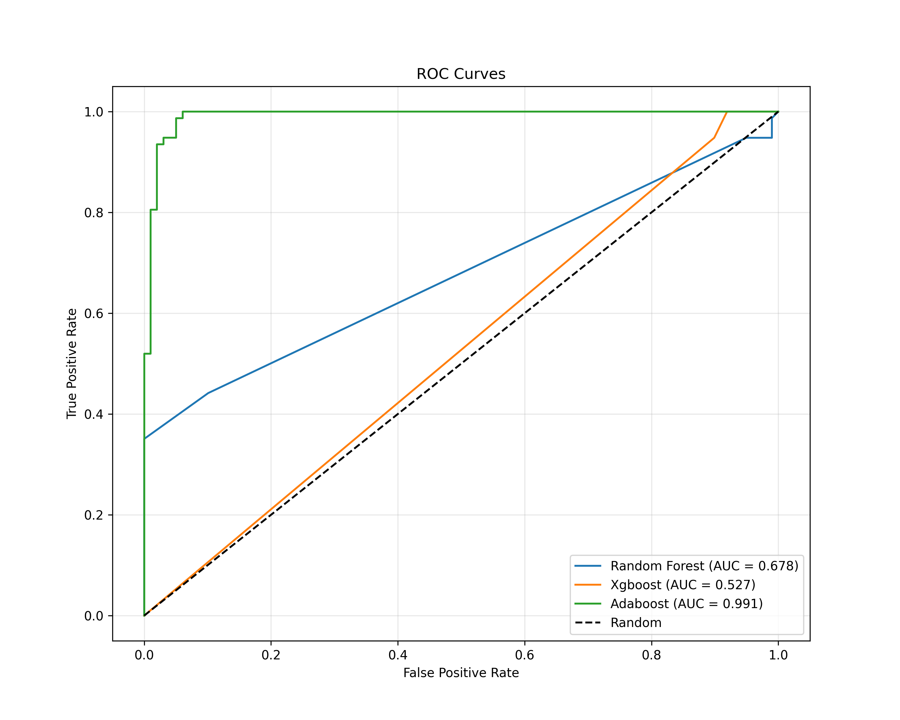

## Association Rule Mining

Let's take a look at the product category distribution, which shows the distribution of products across different categories. The bar chart provides a clear visualization of the number of products in each category, indicating the most popular categories among customers.

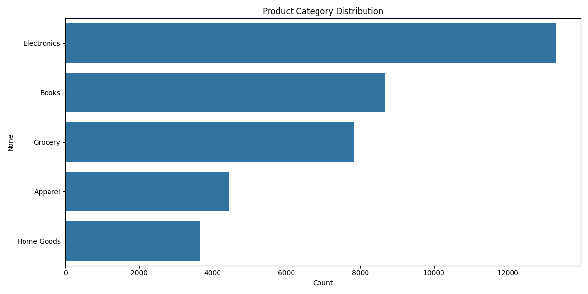

Here is the output of the association rule mining, which shows the relationships between products purchased by customers. The rules are generated using the Apriori algorithm, and the results are visualized using a heatmap. The heatmap shows the support, confidence, and lift of the rules, indicating the strength of the relationships between products.

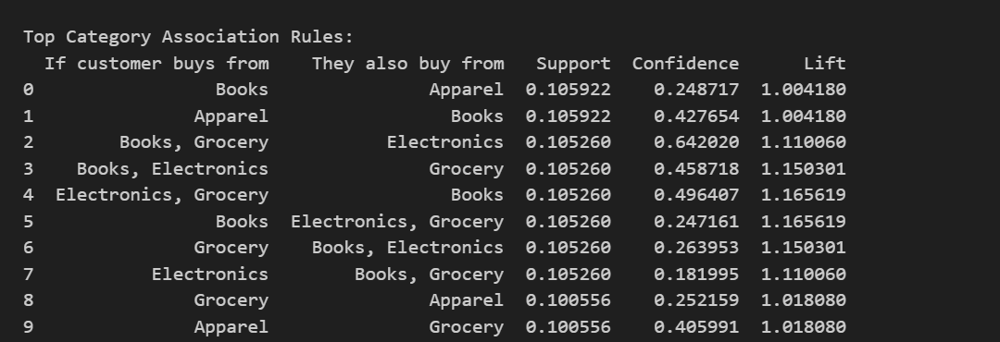

### Implementation Strategy:
1. **Store Layout Optimization**:
   - Reorganize product placements based on discovered associations
   - Create "customer journey" paths that follow frequent purchase patterns

2. **Targeted Marketing Campaigns**:
   - Develop store-specific promotions based on unique association patterns
   - Create bundled offerings of frequently co-purchased items

3. **Inventory Management**:
   - Ensure complementary products are stocked together
   - Adjust inventory levels based on association strengths

4. **Staff Training**:
   - Educate staff on cross-selling opportunities specific to each store
   - Implement suggestive selling based on top association rules

5. **Further Analysis**:
   - Conduct temporal analysis to identify seasonal patterns
   - Segment customers and analyze basket patterns by segment
   - Implement A/B testing to validate recommendations